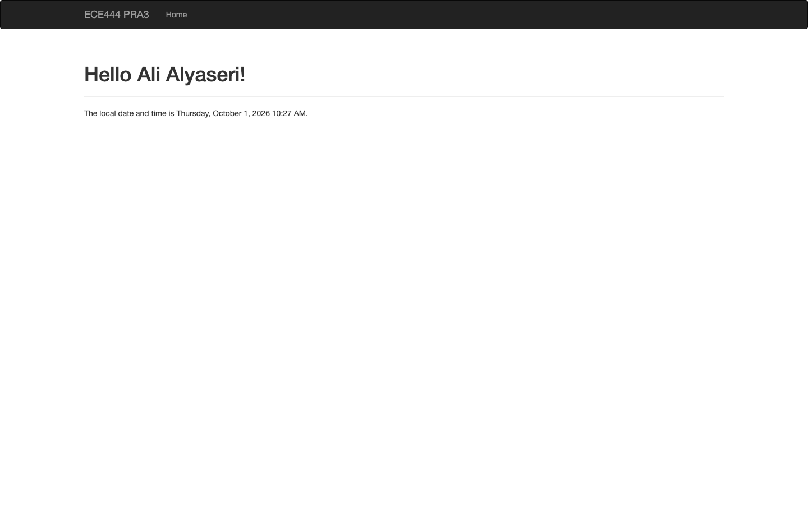
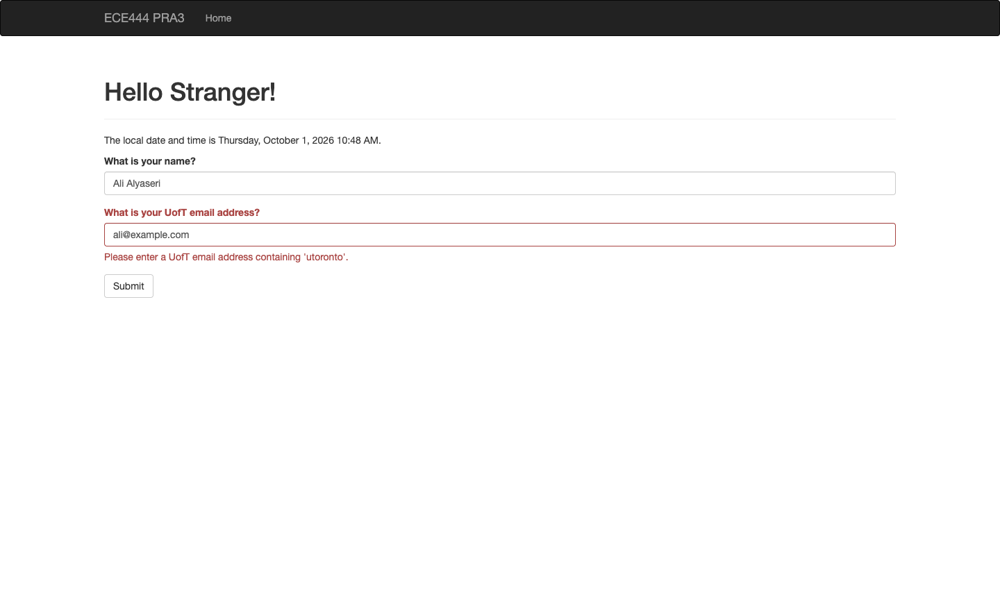

# E444-F2026-PRA3

Author: Ali Alyaseri

This repository is a clone of <https://github.com/miguelgrinberg/flasky>. I am using it to complete the Flask and Docker activities for ECE444 PRA3.

## Local summary

For Activity 1.2, I reproduced examples 2-1 and 2-2 from the Flask textbook. Example 2-1 adds a basic home page that displays `Hello World!`. Example 2-2 adds a dynamic route that displays the name included in the URL.

## How to run the examples

From the root of this repository, create and activate a virtual environment:

```bash
python3 -m venv .venv
source .venv/bin/activate
```

Install Flask and the extensions used by the examples:

```bash
python -m pip install Flask Flask-Bootstrap Flask-Moment Flask-WTF email-validator
```

Start the development server:

```bash
flask --app hello run --debug
```

Open these pages in a browser:

- Example 2-1: <http://127.0.0.1:5000/>
- Example 2-2: <http://127.0.0.1:5000/user/Ali>

The name at the end of the second URL can be changed to test the dynamic route. For example, `/user/Sam` displays `Hello, Sam!`.

Press `Control-C` in the terminal to stop the server. Run `deactivate` when the virtual environment is no longer needed.

## Activity 1.3

For Activity 1.3, I moved the page into Jinja templates and added a Bootstrap navigation bar. The home page displays my name and uses Flask-Moment to show the local date and time in `LLLL` format.



## Activity 1.4

For Activity 1.4, I added a Flask-WTF form that asks for a name and email address. The form checks that the email address is valid and contains `utoronto`. After a valid submission, the page displays the submitted name and UofT email address.

I tested the required cases:

- A first name and valid UofT email are accepted and displayed.
- A name entered in the email field produces an invalid email error.
- A valid non-UofT email produces a UofT email error.



## Activities 2.2 and 2.3

I installed Docker Desktop and verified the Docker engine by running the official `hello-world` container. I also updated the application heading to welcome the user to PRA3 Docker.

To verify Docker locally, I used:

```bash
docker --version
docker compose version
docker run --rm hello-world
```
